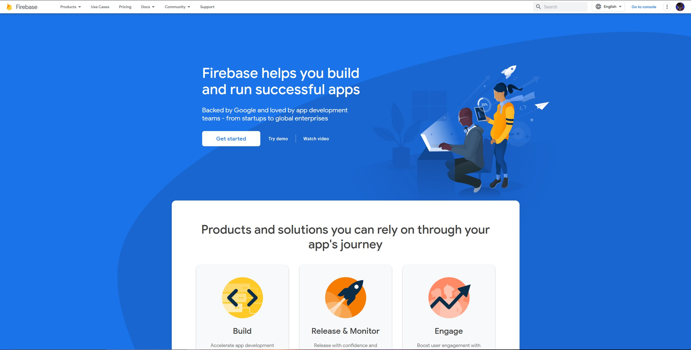
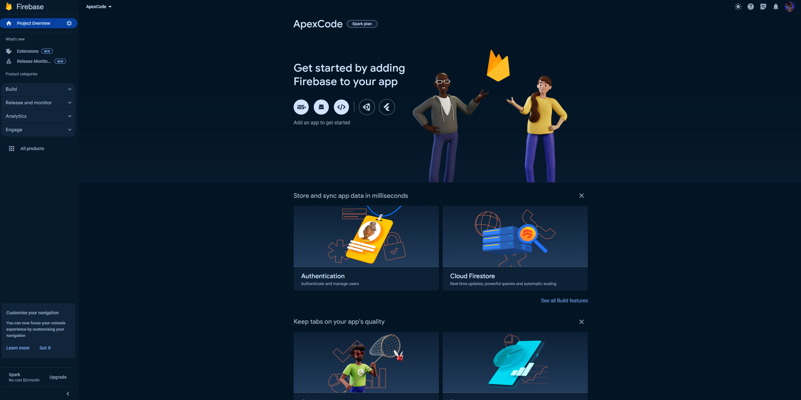

# ApexCode

description here

## Local development

This guide assumes that you are developing this project in Windows operating system and uses VScode as your primary code editor.

### Getting started

1. Clone the repository into your local machine

    ```powershell
    git clone https://github.com/AlstonChan/ApexCode.git
    ```

2. If you need to develop/test the firebase related code locally, install `firebase-tools` or the _CLI_ so you can use Firebase emulator.

    ```bash
    npm install firebase-tools -g
    ```

    If you do not want to install the package globally, run the following command to install the package scoped to the current project.

    ```bash
    npm install
    ```

    To access the package, append `npx` before running any command. For example: `npx firebase -h`.

    For full firebase setup, please refer to the section _Firebase setup_ below.

3. Open `index.html` directly or by running a live server for hot reloading too see the web page.

4. If you have setup the firebase, and wish to develop using firebase emulators, run the following command:

   ```powershell
   npm run emulators:import
   ```

   This will populate the emulator with data instead of having a empty emulator with no data.
   The default user for testing is:
   - Email : mok@chunhao.com
   - Password : 123456789

### Firebase setup

1. Firstly, go to [Firebase](https://firebase.google.com/), you should see this page. Click the top right **Sign in** button if you haven't sign in yet and click _Get started_ button.
   

2. Next, click _Add project_ and enter a project name you desired (_ApexCode_), then proceed to create your Firebase project.

3. Below is your **firebase console**, create a web app and register a name.
   

   - Since this is project uses vanilla HTML, CSS and Javascript only, select _Use a \<script\> tag_ option. Copy the content of the script tag into `firebase-config.js`.

4. Go to your **[Firebase console](https://console.firebase.google.com/u/0/)**, select the project and navigate to `Authentication` section. Click get started and enable **`Email/Password`** auth, this app will use the selected providers to authenticate user.

5. Next, navigate to `Firestore Database` section. Click get started and create a database, select any location you want the data to be stored (This setting cannot be changed later). Next, select _Start in **Test mode**_ so that you can access to your firestore later without getting unauthorized error, unless you know what you are doing.

6. Lastly, navigate to `Storage` section. Select _Start in **Test mode**_ so that you can access to your firestore later without getting unauthorized error, unless you know what you are doing.

#### Firebase CLI Setup

Make sure you have done the **Firebase Setup** before proceeding to this section, as error will occur if the firebase isn't setup in the interface with this guide.

1. Go to your text editor, in my case, I am using [Visual Studio Code](https://code.visualstudio.com/). Login to the Firebase CLI using the following command, You will be redirected to your browser to login.

   ```bash
   npx firebase login
   ```

2. After you have successfully login to the Firebase CLI, enter this command to initialize your firebase project to this application.

   ```bash
   npx firebase init
   ```

3. You will be greeted with a big **FIREBASE** word and you will be asked the following question:

   1. **Are you ready to proceed?**
      _Response_: type `y`

   2. **Which Firebase features do you want to set up for this directory? Press Space to select features, then Enter to confirm your choices.**
      _Response_: select `Firestore`, `Storage` and `Emulators` by pressing space. Use arrow key to navigate your option up and down. After you have selected these three options, press `Enter`.

   3. **Select a default Firebase project for this directory: (Use arrow keys)**
      _Response_: Use a existing project and select the Firebase project that you just initialize. Press `Enter` to proceed.

   4. **What file should be used for Firestore Rules?**
      _Response_: press `Enter`; Use the default `firestore.rules`

   5. **File firestore.rules already exists. Do you want to overwrite it with the Firestore Rules from the Firebase Console?**
      _Response_: type `n`

   6. **What file should be used for Firestore indexes?**
      _Response_: press `Enter`; Use the default `firestore.indexes.json`

   7. **File firestore.indexes.json already exists. Do you want to overwrite it with the Firestore Indexes from the Firebase Console?**
      _Response_: type `n`

   8. **What file should be used for Storage Rules?**
      _Response_: press `Enter`; Use the default `storage.rules`

   9. **File _storage.rules_ already exists. Overwrite?**
      _Response_: type `n`

   10. **Which Firebase emulators do you want to set up? Press Space to select emulators, then Enter to confirm your choices.**
       _Response_: select `Firestore Emulator`, `Storage Emulator` and `Authentication Emulator` by pressing space. Use arrow key to navigate your option up and down. After you have selected these three options, press `Enter`.

   11. **Which port do you want to use for the auth emulator?**
       _Response_: press `Enter`; Use the default port `9099`

   12. **Which port do you want to use for the firestore emulator?**
       _Response_: press `Enter`; Use the default port `8080`

   13. **Which port do you want to use for the storage emulator?**
       _Response_: press `Enter`; Use the default port `9199`

   14. **Would you like to enable the Emulator UI?**
       _Response_: type `y`

   15. **Which port do you want to use for the Emulator UI (leave empty to use any available port)?**
       _Response_: press `Enter` or type `4000`

   16. **Would you like to download the emulators now?**
       _Response_: type `y`

**Note:** You might not meet the same questions as listed in the order above, I might missed some questions.

### Recommended VScode extension

The following VScode extension is recommended to install to provide a better developer experience (DX) and streamline your development.

- [Markdown All in One](https://marketplace.visualstudio.com/items?itemName=yzhang.markdown-all-in-one)
- [markdownlint](https://marketplace.visualstudio.com/items?itemName=DavidAnson.vscode-markdownlint)
- [Live Server](https://marketplace.visualstudio.com/items?itemName=ritwickdey.LiveServer)
- [HTML CSS Support](https://marketplace.visualstudio.com/items?itemName=ecmel.vscode-html-css)
- [Code Spell Checker](https://marketplace.visualstudio.com/items?itemName=streetsidesoftware.code-spell-checker)
- [Auto Rename Tag](https://marketplace.visualstudio.com/items?itemName=formulahendry.auto-rename-tag)
- [lit-html](https://marketplace.visualstudio.com/items?itemName=bierner.lit-html)

## License

This project uses [Mozilla Public License Version 2.0](https://www.mozilla.org/en-US/MPL/2.0/).